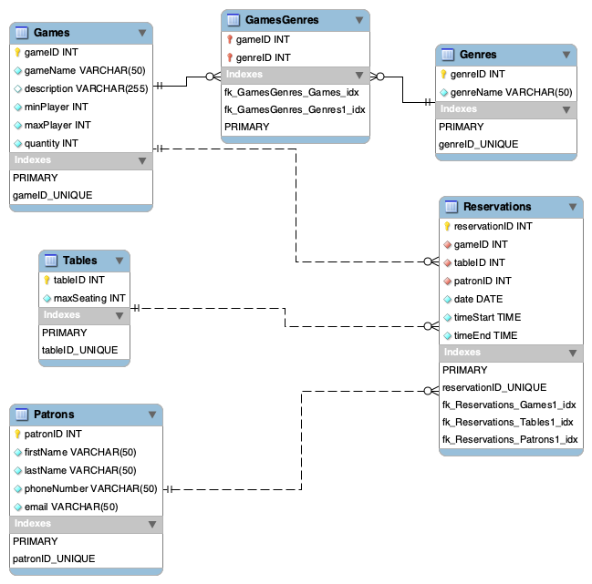

# Reservation Managment Database

## Overview
Pass The Dice is a board game cafe that recently opened in a bustling area that allows patrons to reserve a table and games to play with friends. The owners of the cafe are looking for a website with a database backend to help keep track of all their games and table reservations.

The cafe currently owns around 20 board games and is slowly building their collection (so they want to be able to easily add/remove game titles). They also have 10 tables that range from 2 - 8 people. On average, the cafe sees approximately 30 patrons on the weekdays and 50 patrons on the weekends. 

Tracking includes recording active tables and game reservations. The cafe's goal is to be able to take reservations based on party size, available tables, and available games. 

The goal of this project is to build a database-driven website that:
- Allows patrons to reserve tables and games.
- Helps owners track active reservations.
- Supports easy management of games, tables, and patrons.

## Schema Diagram

## Database Entities

### **Games**
Holds information about each board game.
- `gameID` (INT, PK, AUTO_INCREMENT, NOT NULL)
- `gameName` (VARCHAR(50), NOT NULL)
- `description` (VARCHAR(255))
- `minPlayer` (INT, NOT NULL)
- `maxPlayer` (INT, NOT NULL)
- `quantity` (INT, NOT NULL)
**Relationship 1:** a M:N relationship
- 1:M with **Reservations** (`gameID` as FK)
- M:N with **Genres** (via `GamesGenres`)

---

### **Genres**
Categories of board games (e.g., action, story, puzzle).

**Fields**
- `genreID` (INT, PK, AUTO_INCREMENT, NOT NULL)
- `genreName` (VARCHAR(50), NOT NULL)
**Relationships**
- M:N with **Games** (via `GamesGenres`)

---

### **Tables**
Seating options available for patrons.

**Fields**
- `tableID` (INT, PK, AUTO_INCREMENT, NOT NULL)
- `maxSeating` (INT, NOT NULL)

**Relationships**
- 1:M with **Reservations** (`tableID` as FK)

---

### **Patrons**
Information about customers making reservations.

**Fields**
- `patronID` (INT, PK, AUTO_INCREMENT, NOT NULL)
- `firstName` (VARCHAR(50), NOT NULL)
- `lastName` (VARCHAR(50), NOT NULL)
- `phoneNumber` (VARCHAR(15), NOT NULL)
- `email` (VARCHAR(100), NOT NULL)

**Relationships**
- 1:M with **Reservations** (`patronID` as FK)

---

### **Reservations**
Records of bookings made by patrons.

**Fields**
- `reservationID` (INT, PK, AUTO_INCREMENT, NOT NULL)
- `patronID` (INT, FK → Patrons, NOT NULL)
- `tableID` (INT, FK → Tables, NOT NULL)
- `gameID` (INT, FK → Games, NOT NULL)
- `date` (DATE, NOT NULL)
- `timeStart` (TIME, NOT NULL)
- `timeEnd` (TIME, NOT NULL)

**Relationships**
- 1:M with **Patrons**
- 1:M with **Tables**
- 1:M with **Games**

---

### **GamesGenres**
Intersection table linking games to genres.

**Fields**
- `gameID` (INT, FK → Games, NOT NULL)
- `genreID` (INT, FK → Genres, NOT NULL)  
*Primary Key:* (`gameID`, `genreID`)

**Relationships**
- 1:M with **Games**
- 1:M with **Genres**

## Run Modes
### Local
* Build and Run: `npm run start`
* Build and Run in Debug (nodemon): `npm run development`

### Production
* Build and Run with Forever: `npm run production`
* Stop Forever Production Run: `npm run stop production`

## Citations:
Date: 8/14/2025
Structures and Setup taken from Canvas 
* Activity 2 - Connect webapp to database: https://canvas.oregonstate.edu/courses/2007765/assignments/10118865
* Exploration - Web Application Technology: https://canvas.oregonstate.edu/courses/2007765/pages/exploration-web-application-technology-2?module_item_id=25664612

Handlebar: 
https://handlebarsjs.com/guide/

AI Use:
ReadME: Help with streamlining these entities and attributes so it is aesthetic on the page.
Other uses of AI noted in the citations of each file

  
